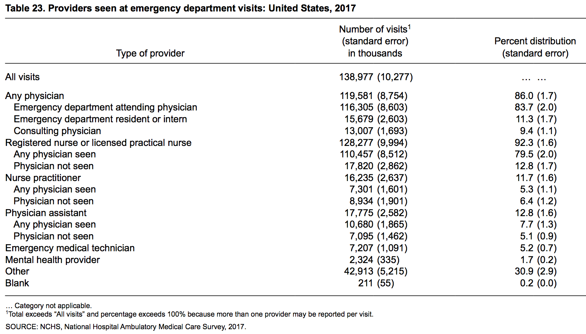

```{r setup, include=FALSE}
knitr::opts_chunk$set(echo = TRUE)
library(tidyverse)
library(googlesheets)
select <- dplyr::select
```


```{r echo=F, eval=F}
#Import Directly From GoogleSheets: https://cran.r-project.org/web/packages/googlesheets/googlesheets.pdf 
GS_NHAMCS <- gs_url("https://docs.google.com/spreadsheets/d/1EUVD_uXAi0KL0I3MFv9gs0FEnXpDI2UUHhqNn-i6b6U/edit#gid=637051178")
NHAMCS_Sum_Prov <- gs_read(GS_NHAMCS, ws = 'Extracted')
save(NHAMCS_Sum_Prov, file="NHAMCS_Sum_Prov.RData")
```

# Data Source

In a previous post, we reviewed how to combine all NHAMCS data across multiple years, however if you are simply wanting to trend one summary statistic over multiple years, you can also manually extract these values from the NHAMCS Summary Tables.^[https://www.cdc.gov/nchs/ahcd/web_tables.htm]

For example, if we want to track the percentage of patients seen by PAs/NPs over time, we can look to the "Providers seen at emergency department visits" tables.

```{r}

```

# Load Manually Extracted Data

```{r}
load("NHAMCS_Sum_Prov.RData")
rmarkdown::paged_table(NHAMCS_Sum_Prov)
```

# Filter Fields

```{r}
NHAMCS <- NHAMCS_Sum_Prov %>% 
  filter(NHAMCS == "Pct_NP" | NHAMCS == "Pct_NP_SE" | 
         NHAMCS == "Pct_PA" | NHAMCS == "Pct_PA_SE")
rmarkdown::paged_table(NHAMCS)
```

# Transpose

```{r}
NHAMCS <- NHAMCS %>% 
  select(NHAMCS, `1999`:`2017`) %>% 
  column_to_rownames(var="NHAMCS") %>% 
  t() %>% as.data.frame() %>% rownames_to_column(var="Year") %>% 
  mutate(Year=as.numeric(Year),
         Pct_Comb=Pct_NP+Pct_PA, Pct_Comb_SE=Pct_PA_SE+Pct_NP_SE)
rmarkdown::paged_table(NHAMCS)
```

# Calculate Combined

```{r}
NHAMCS_NP <- NHAMCS %>% 
  select(Year=1, Percent=2, SE=3) %>% 
  mutate(ClinicianType="NP")

NHAMCS_PA <- NHAMCS %>% 
  select(Year=1, Percent=4, SE=5) %>% 
  mutate(ClinicianType="PA")

NHAMCS_PA_NP <- NHAMCS %>% 
  select(Year=1, Percent=6, SE=7) %>% 
  mutate(ClinicianType="PA or NP")

NHAMCS <- rbind(NHAMCS_NP, NHAMCS_PA, NHAMCS_PA_NP) %>% arrange(Year)
rmarkdown::paged_table(NHAMCS)
```

# Plot

```{r preview=T, layout="l-body-outset"}
NHAMCS %>% ggplot(aes(x=Year, y=Percent, col=ClinicianType))+
  geom_point()+geom_line()+
  geom_errorbar(aes(x=Year,ymin=Percent-2*SE,ymax=Percent+2*SE),
                width=0.5,size=0.3,position=position_dodge(0.3))+
  ylab("Percentage of ED Visits Involving PA or NP")+
  scale_y_continuous(labels = scales::percent_format(accuracy = 1))
```
