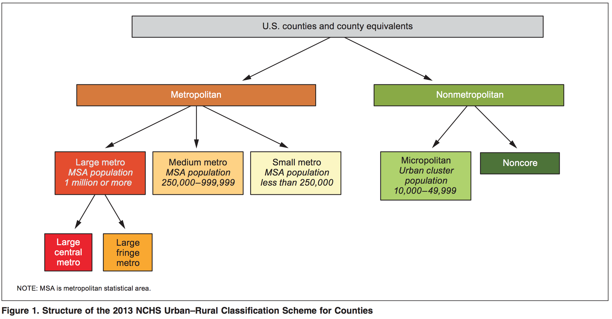

```{r setup, include=FALSE}
#install.packages("distill")
library(distill)
knitr::opts_chunk$set(echo = TRUE)
```

# Mapping 101

The `socviz` library contains a sample dataset of the latitude and longitude points for the border of every county in the United States.^[https://socviz.co/maps.html#map-u.s.-state-level-data] Each county is identified using a FIPS id (the first two numbers are unique to each state).

```{r}
library(tidyverse)
#install.packages("socviz")
library(socviz)
#install.packages("maps")
library(maps)
data(county_map)
rmarkdown::paged_table(county_map)
```

```{r include=F,eval=F,echo=F}
#us_states <- map_data("state")
#rmarkdown::paged_table(us_states)
```

The GPS coordinates of each county can then be used to plot a map of the United States. Define `theme_map` to eliminate all extraneous `ggplot` features from being displayed.

```{r}
theme_map <- function(base_size = 9, base_family = "") {
  theme_bw(base_size = base_size, base_family = base_family) %+replace%
    theme(axis.line = element_blank(),
          axis.text = element_blank(),
          axis.ticks = element_blank(),
          axis.title = element_blank(),
          panel.background = element_blank(),
          panel.border = element_blank(),
          panel.grid = element_blank(),
          panel.spacing = unit(0, "lines"),
          plot.background = element_blank(),
          legend.justification = c(0, 0),
          legend.position = c(0, 0))
}

ggplot(data = county_map, mapping = aes(x = long, y = lat, group = group))+
    theme_map()+
  geom_polygon(color = "white", size = 0.1) + coord_equal()
```

# Urban vs. Rural

The National Center for Health Statistics (NCHS) has devised a number of urban-rural classification schemes over the years, the most recent of which was created in 2013.^[https://www.cdc.gov/nchs/data_access/urban_rural.htm] 

"A key feature of the NCHS urban-rural scheme, which makes it particularly well-suited for health analyses, is that it separates counties within large metropolitan areas (1 million or more population) into two categories: large “central” metro (akin to inner cities) and large “fringe” metro (akin to suburbs). This is an important feature of the NCHS urban-rural scheme because for a number of health measures, residents of large fringe metro areas fare substantially better than residents of other urbanization levels. For these measures, residents of the inner cities and suburbs of large metropolitan areas must be differentiated to obtain an accurate characterization of health disparities across the full urban-rural spectrum."

```{r fig.cap='Figure from https://www.cdc.gov/nchs/data/series/sr_02/sr02_166.pdf'}

```

You can download the `NCHSURcodes2013.xlsx` file from the page above. It contains a unique FIPS code for each county, the two-letter abbreviation of the state the county is in, the county name, the name of the core-based statistical area (CBSA) if applicable, census populations, and urban/rural codes.

```{r}
library(readxl)
FIPS <- read_excel("NCHSURCodes2013.xlsx")
rmarkdown::paged_table(FIPS)
```

Simplify the NCHS dataframe by keeping only the `FIPS code` (which will rename `id`) and  `2013 code` (which we will rename `NCHS_Urban_Rural`) before joining with the `county_map` dataframe imported above.

```{r}
county_full <- FIPS %>% 
  select(id=1,NHCS_Urban_Rural=7) %>% 
  mutate(id = str_pad(id,5,pad=0),
         NHCS_Urban_Rural=as.factor(NHCS_Urban_Rural)) %>% 
  left_join(county_map, by="id")
rmarkdown::paged_table(county_full)
```

# Map NCHS Urban/Rural Classifications

Use the combined dataframe to generate a color-coded county-level map of `NCHS_Urban_Rural` by defining `fill` when creating your map.

```{r preview=T}
ggplot(data = county_full, mapping = aes(x=long, y=lat, fill=NHCS_Urban_Rural, group=group))+
  theme_map() + geom_polygon(color = "white", size = 0.01) + coord_equal() +
  scale_fill_manual(values=c("#E52027","#FFA900","#FFD56E","#FAFABA","#A2DA58","#3E792F"),
                    labels=c("Large central metro","Large fringe metro","Medium metro",
                      "Small metro","Micropolitan","Noncore"))+theme(legend.position="right")
```

# Converting ZIP to FIPS

Many datasets may contain ZIP codes rather than FIPS (county) codes. The U.S. Department of Housing and Urban Development (HUD) has created a number of cross-walk files for different types of geographic data,^[https://www.huduser.gov/portal/datasets/usps_crosswalk.html] including ZIP to FIPS.^[https://www.huduser.gov/portal/periodicals/cityscpe/vol20num2/ch16.pdf]

```{r warning=F,message=F}
ZIP_to_FIPS <- read_excel("ZIP_COUNTY_092020.xlsx", col_types="numeric")
rmarkdown::paged_table(ZIP_to_FIPS)
```

As you can see, 26k out of 54k ZIP codes map to more than one county, however when looking at the ratio of residents within each ZIP (`RES_RATIO`), you can see that the majority of them usually live in a single county.

```{r}
options(scipen=999) # prevents scientific notation
ZIP_to_FIPS %>% group_by(ZIP) %>% mutate(Count = n()) %>% 
  filter(Count > 1) %>% rmarkdown::paged_table(.)
```
## CBSA

https://www.census.gov/geographies/reference-files/time-series/demo/metro-micro/delineation-files.html

```{r}
CBSA <- read_excel("list1_2020.xls") %>% 
  unite("id", `FIPS State Code`:`FIPS County Code`, sep="") #%>% 
  # mutate(CBSA_TYPE = case_when(`Metropolitan/Micropolitan Statistical Area` == "Metropolitan Statistical Area" ~ "Metropolitan",
  #                              `Metropolitan/Micropolitan Statistical Area` == "Micropolitan Statistical Area" ~ "Micropolitan",
  #                              TRUE ~ "None"))
  
CBSA %>%   
  full_join(county_map) %>% 
  ggplot(mapping = aes(x=long, y=lat, fill=`Metropolitan/Micropolitan Statistical Area`, group=group))+
  theme_map() + geom_polygon(color = "white", size = 0.01) + coord_equal() + theme(legend.position = "right")

#+
  #scale_fill_manual(values=c("#E52027","#FFA900","#FFD56E","#FAFABA","#A2DA58","#3E792F"),
                    # labels=c("Large central metro","Large fringe metro","Medium metro",
                    #   "Small metro","Micropolitan","Noncore"))+theme(legend.position="right")
```

