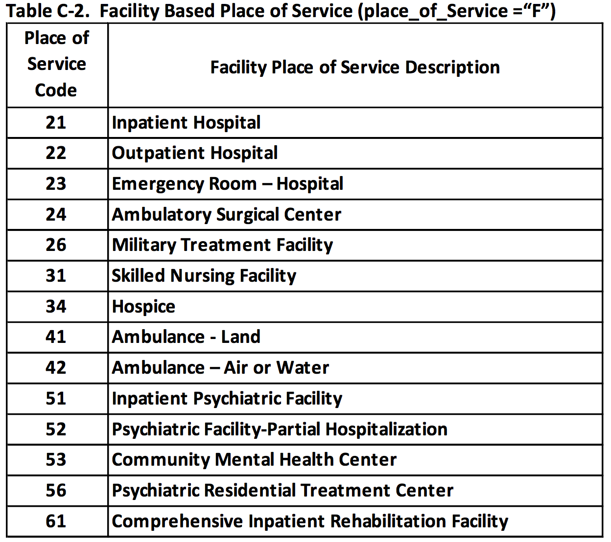

```{r setup, include=FALSE}
knitr::opts_chunk$set(echo = TRUE)
library(tictoc)
library(tidyverse)
library(dplyr)
library(readxl)
library(knitr)
options(scipen=999)

# install.packages("devtools")
# install.packages("ellipsis")
#library(devtools)
#install.packages("withr")
#library(withr)
#devtools::install_github("ijlyttle/codefolder")
#library(codefolder)
```

```{r include=F, htmlTemp3, echo=FALSE, eval=TRUE}
# codejs <- readr::read_lines("js/codefolding.js")
# collapsejs <- readr::read_lines("js/collapse.js")
# transitionjs <- readr::read_lines("js/transition.js")
# 
# htmlhead <- 
#   paste('
# <script>',
# paste(transitionjs, collapse = "\n"),
# '</script>
# <script>',
# paste(collapsejs, collapse = "\n"),
# '</script>
# <script>',
# paste(codejs, collapse = "\n"),
# '</script>
# <style type="text/css">
# .code-folding-btn { margin-bottom: 4px; }
# .row { display: flex; }
# .collapse { display: none; }
# .in { display:block }
# </style>
# <script>
# $(document).ready(function () {
#   window.initializeCodeFolding("show" === "show");
# });
# </script>
# ', sep = "\n")
# 
# readr::write_lines(htmlhead, path = "header.html")
```


<!-- https://www.ers.usda.gov/data-products/rural-urban-commuting-area-codes.aspx#:~:text=The%20rural%2Durban%20commuting%20area,%2C%20urbanization%2C%20and%20daily%20commuting.&text=Whole%20numbers%20(1%2D10),primary%20(largest)%20commuting%20flows. -->

## Medicare Part B

Each year CMS releases "Medicare Provider Utilization and Payment Data" Public Use Files (PUF),^[https://www.cms.gov/Research-Statistics-Data-and-Systems/Statistics-Trends-and-Reports/Medicare-Provider-Charge-Data] including a PUF containing information detailing the services provided by physicians and non-physician practitioners ("Physician and Other Supplier" data).^[https://www.cms.gov/Research-Statistics-Data-and-Systems/Statistics-Trends-and-Reports/Medicare-Provider-Charge-Data/Physician-and-Other-Supplier]. These files list the name, NPI number, practice location, and a summary of all HCPCS/CPT codes submitted while caring for patients covered by the traditional Part B Medicare FFS (fee-for-service) program.

### What's in the Data Set?

CMS provides a 27-page methods document outlining the creation of each year's public use files.^[https://www.cms.gov/Research-Statistics-Data-and-Systems/Statistics-Trends-and-Reports/Medicare-Provider-Charge-Data/Downloads/Medicare-Physician-and-Other-Supplier-PUF-Methodology.pdf] A few noteworthy attributes:

- "The data in the Physician and Other Supplier PUF may not be representative of a physician’s entire practice. The data in the file only have information for Medicare beneficiaries with Part B FFS coverage, but physicians typically treat many other patients who do not have that form of coverage."
- Medicare only (65+ years old, young/disabled, ESRD)
- Medicare fee-for-service only (no Medicare Advantage data)
- contain 100% final-action (all claim adjustments resolved), non-institutional items^[DMEPOS (Durable Medical Equipment, Prosthetic, Orthotics and Supplies) data can be found here: https://www.cms.gov/Research-Statistics-Data-and-Systems/Statistics-Trends-and-Reports/Medicare-Provider-Charge-Data/DME]
- "There can be multiple records for a given NPI based on the number of distinct HCPCS codes that were billed and where the services were provided. Data have been aggregated based on the place of service because separate fee schedules apply depending on whether the place of service submitted on the claim is facility or non-facility."


### Limitations of the Data Set

- "The data in the Physician and Other Supplier PUF may not be representative of a physician’s entire practice. The data in the file only have information for Medicare beneficiaries with Part B FFS coverage, but physicians typically treat many other patients who do not have that form of coverage"
- "The data are not risk adjusted and thus do not account for difference in the underlying severity of disease of patient populations treated by providers"
- "Does not include data for services that were performed on 10 or fewer beneficiaries, so users should be aware that summing the data in the file may underestimate the true Part B FFS totals"
- "In addition, some providers bill under both an individual NPI and an organizational NPI. In this case, users cannot determine a provider’s actual total because there is no way to identify the individual’s portion when billed under their organization."

<!-- - Specialty (EM vs. non-EM physicians) based on self reporting to Medicare -->

### About HCPCS Codes

"Each year, in the United States, health care insurers process over 5 billion claims for payment. For Medicare and other health insurance programs to ensure that these claims are processed in an orderly and consistent manner, standardized coding systems are essential. The HCPCS Level II Code Set is one of the standard code sets used for this purpose. The HCPCS is divided into two principal subsystems, referred to as level I and level II of the HCPCS. Level I of the HCPCS is comprised of CPT (Current Procedural Terminology), a numeric coding system maintained by the American Medical Association (AMA). The CPT is a uniform coding system consisting of descriptive terms and identifying codes that are used primarily to identify medical services and procedures furnished by physicians and other health care professionals. These health care professionals use the CPT to identify services and procedures for which they bill public or private health insurance programs."^[https://www.cms.gov/Medicare/Coding/MedHCPCSGenInfo/index]

https://data.cms.gov/Medicare-Physician-Supplier/Medicare-National-HCPCS-Aggregate-Summary-Table-CY/w9tx-4vq9

## Importing Data

### Create RData Files for Individual Years

<aside>
```{r codefolder, echo=FALSE, results='asis'}
codefolder::distill(init = "hide")
```
</aside>

At the time of this post, "Physician and Other Supplier Data" was available for calendar years 2012-2018.A "Downloadable Tab Delimited Format" file can be downloaded for each year. Each year's tab delimited download is a 400-500MB ZIP file that unzips to a ~2GB TXT file. 

The following R code can be modified and run to import each year's worth of data: 

```{r eval=F}
# import TXT to R data frame
MedicarePUF <- read.delim("Medicare_Provider_Util_Payment_PUF_CY2012.txt", 
                          header = TRUE, sep = "\t", dec = ".")

# change column names to lower case (earlier years are capitalized)
names(MedicarePUF) <- tolower(names(MedicarePUF))
```

Given the extremely large size of the dataframe that is imported, we will export data related only to emergency department visits for further analysis. We will save subsets of this data in two ways:

1) save ONLY rows containing emergency medicine (EM) E/M codes (99281-99285)
2) save ALL rows for ANY provider who billed AT LEAST ONE EM E/M code (this will allow for analyzing critical care and procedural services; it may also help identify whether each clinician provides a majority or minority of their time providing emergency care)

```{r eval=F}
# save ONLY rows containing EM E/M codes (99281-99285)
# find/replace instances of `12` with the year of data you're importing
PartB_12_9928x <- MedicarePUF %>% 
  filter(hcpcs_code == 99281 |
           hcpcs_code == 99282 |
           hcpcs_code == 99283 |
           hcpcs_code == 99284 |
           hcpcs_code == 99285 )
save(PartB_12_9928x, file="PartB_12_9928x.RData")

# save ALL rows for ANY provider who billed AT LEAST ONE EM E/M code 
# find/replace instances of `12` with the year of data you're importing
PartB_12_All <- PartB_12_9928x %>% select(npi) %>% unique() %>% left_join(MedicarePUF)
save(PartB_12_All, file="PartB_12_All.RData")
```

### Combine Individual Years into One Large RData File

Each year's worth of data contains ~16-18k rows and 27-29 columns. Running the following code will combine the data for each individiual year into one larger data frame. 

Load each year's RData file:

```{r eval=F}
# load("PartB_12_9928x.RData")
# load("PartB_13_9928x.RData")
# load("PartB_14_9928x.RData")
# load("PartB_15_9928x.RData")
# load("PartB_16_9928x.RData")
# load("PartB_17_9928x.RData")
# load("PartB_18_9928x.RData")

load("PartB_12_All.RData")
load("PartB_13_All.RData")
load("PartB_14_All.RData")
load("PartB_15_All.RData")
load("PartB_16_All.RData")
load("PartB_17_All.RData")
load("PartB_18_All.RData")
```

Add new column to represent the year in each data frame:

```{r eval=F}
# PartB_12_9928x$year=2012
# PartB_13_9928x$year=2013
# PartB_14_9928x$year=2014
# PartB_15_9928x$year=2015
# PartB_16_9928x$year=2016
# PartB_17_9928x$year=2017
# PartB_18_9928x$year=2018

PartB_12_All$year=2012
PartB_13_All$year=2013
PartB_14_All$year=2014
PartB_15_All$year=2015
PartB_16_All$year=2016
PartB_17_All$year=2017
PartB_18_All$year=2018
```

Combine, clean-up, and save:

```{r eval=F}
# PartB_12_18_9928x <- bind_rows(PartB_12_9928x, PartB_13_9928x, PartB_14_9928x, 
#           PartB_15_9928x, PartB_16_9928x, PartB_17_9928x, PartB_18_9928x)
# 
# rm(PartB_12_9928x, PartB_13_9928x, PartB_14_9928x,
#    PartB_15_9928x, PartB_16_9928x, PartB_17_9928x, PartB_18_9928x)
#
# save(PartB_12_18_9928x,file="PartB_12_18_9928x.RData")

PartB_12_18_All <- bind_rows(PartB_12_All, PartB_13_All, PartB_14_All, 
          PartB_15_All, PartB_16_All, PartB_17_All, PartB_18_All)

rm(PartB_12_All, PartB_13_All, PartB_14_All, 
          PartB_15_All, PartB_16_All, PartB_17_All, PartB_18_All)

save(PartB_12_18_All,file="PartB_12_18_All.RData")
```

```{r echo=F}
#load("PartB_12_18_All.RData")
# names<-head(PartB_12_18_All)
# save(names,file="PartB_Names.RData")
load("PartB_Names.RData")


#rm(PartB_12_18_All)
load("PartB.RData")
```

## Data Exploration

### Column Names

```{r eval=F}
#names(PartB_12_18_All)
```

```{r echo=F}
names(names)
```


We will keep only a subset of these columns for further analysis.

```{r eval=F}
# PartB <- PartB_12_18_9928x %>% 
#   select(npi, nppes_provider_gender, nppes_provider_zip, nppes_provider_state,
#          provider_type, place_of_service, hcpcs_code, hcpcs_description, line_srvc_cnt, year)

PartB <- PartB_12_18_All %>% 
  select(npi, nppes_provider_gender, nppes_provider_zip, nppes_provider_state,
         provider_type, place_of_service, hcpcs_code, hcpcs_description, line_srvc_cnt, year)
save(PartB, file="PartB.RData")
```


### Summary By Year

```{r layout="l-page", warning=F,message=F}
PartB %>% group_by(year) %>% 
  summarise(nRows = n(), 
            nProviders = n_distinct(npi),
            nProviderTypes = n_distinct(provider_type),
            nUniqueCPTCodes = n_distinct(hcpcs_code),
            nServices = sum(line_srvc_cnt)) %>% 
  knitr::kable(.)
  #rmarkdown::paged_table(.)
```

<!-- ### Summary By Place of Service -->

```{r include=F, warning=F,message=F}
# PartB %>% group_by(place_of_service) %>% 
#   summarise(nServices = sum(line_srvc_cnt)) %>%
#   rmarkdown::paged_table(.)
# 
# PartB %>% group_by(year, place_of_service) %>% 
#   summarise(nServices = sum(line_srvc_cnt)) %>% 
#   spread(place_of_service,nServices) %>% 
#   rmarkdown::paged_table(.)
```

<!--  -->


```{r include=F}
# PartB %>% group_by(npi) %>% summarise(Num_Unique_CPT_Codes=n_distinct(hcpcs_code)) %>% 
#   arrange(desc(Num_Unique_CPT_Codes)) %>% summary(Num_Unique_CPT_Codes)
# 
# 
# PartB %>% group_by(npi) %>% summarise(Num_Unique_CPT_Codes=n_distinct(hcpcs_code)) %>% 
#   arrange(desc(Num_Unique_CPT_Codes)) %>% summary(Num_Unique_CPT_Codes)
# 
# PartB %>% group_by(npi) %>% summarise(Num_Unique_CPT_Codes=n_distinct(hcpcs_code)) %>% 
#   ggplot(aes(x=Num_Unique_CPT_Codes))+geom_histogram()
```

### Number of Clinicians Per `provider_type`

```{r include=F, warning=F,message=F}
# this is the same as the chart below before applying SPREAD
# PartB %>% select(year,npi,provider_type) %>% unique() %>%
#   group_by(year,provider_type) %>% summarise(Num_Providers=n()) %>%
#   arrange(desc(Num_Providers))
```

We can see that providers from a wide variety of specialties submitted 99281-99285 E/M codes. This table has been filtered to display only the top 12 provider_types (which had at least 100 providers bill for emergency E/M services in 2018).

```{r layout="l-page",warning=F,message=F}
PartB %>% select(year,npi,provider_type) %>% unique() %>%
  group_by(year,provider_type) %>% summarise(Num_Providers=n()) %>%
  spread(year,Num_Providers) %>%
  arrange(desc(`2018`)) %>% 
  head(12) %>% 
  knitr::kable(.)
  #rmarkdown::paged_table(.)
```

Since many providers may have submitted 99281-99285 codes for consults, we will focus on only the top 5 providers types and graph the growth in the number of providers over time.

```{r include=F}
    # could alternatively keep only top 5-9 provider_types
    # filter(provider_type=="Emergency Medicine" |
    #      provider_type=="Physician Assistant" |
    #      provider_type=="Nurse Practitioner" |
    #      provider_type=="Family Practice" |
    #      provider_type=="Internal Medicine" |
    #      provider_type=="General Surgery" |
    #      provider_type=="Psychiatry" |
    #      provider_type=="Cardiology" |
    #      provider_type=="General Practice") %>%
```


```{r layout="l-page",warning=F,message=F}
PartB_6provider_types <- PartB %>% 
  #group_by(npi) %>% #filter(sum(hcpcs_9928x,na.rm=T) >= 100) %>% ungroup() %>% 
  mutate(provider_type=case_when(
    provider_type=="Emergency Medicine" ~ "Emergency Medicine",
    provider_type=="Physician Assistant" ~ "Physician Assistant",
    provider_type=="Nurse Practitioner" ~ "Nurse Practitioner",
    provider_type=="Family Practice" ~ "Family Practice",
    provider_type=="Internal Medicine" ~ "Internal Medicine",
    TRUE~"Other"))

PartB_6provider_types %>% 
  select(year,npi,provider_type) %>% 
  unique() %>% 
  group_by(year,provider_type) %>% summarise(Num_Providers=n()) %>% 
  ggplot(aes(x=year,y=Num_Providers,fill=provider_type))+
  geom_col()+scale_x_continuous(breaks=seq(2012,2018,1))
```

```{r layout="l-page",warning=F,message=F}
PartB_6provider_types_100 <- PartB %>% 
  filter(year==2018) %>% 
  filter(str_detect(hcpcs_code,"9928")) %>% 
  group_by(npi) %>% mutate(hcpcs_9928x=sum(line_srvc_cnt))
  
PartB_6provider_types_100 %>% 
  select(npi,hcpcs_9928x) %>% unique() %>% 
  ggplot(aes(x=hcpcs_9928x))+geom_histogram(binwidth = 100,col="black",fill="white")  

  # group_by(npi) %>% filter(sum(hcpcs_9928x,na.rm=T) >= 100) %>% ungroup() %>% 
  # mutate(provider_type=case_when(
  #   provider_type=="Emergency Medicine" ~ "Emergency Medicine",
  #   provider_type=="Physician Assistant" ~ "Physician Assistant",
  #   provider_type=="Nurse Practitioner" ~ "Nurse Practitioner",
  #   provider_type=="Family Practice" ~ "Family Practice",
  #   provider_type=="Internal Medicine" ~ "Internal Medicine",
  #   TRUE~"Other"))

PartB_6provider_types_100 %>% 
  select(year,npi,provider_type) %>% 
  unique() %>% 
  group_by(year,provider_type) %>% summarise(Num_Providers=n()) %>% 
  ggplot(aes(x=year,y=Num_Providers,fill=provider_type))+
  geom_col()+scale_x_continuous(breaks=seq(2012,2018,1))
```
```{r}
n_distinct(PartB_6provider_types_100$npi)
PartB_6provider_types_100 %>% 
  group_by(provider_type) %>% summarise(n_NPI = n_distinct(npi)) %>% arrange(desc(n_NPI))
```

### Total Number of Emergency Department E/M Codes Per Year (in Millions)

Showing total codes submitted by all providers regardless of provider type.

```{r layout="l-page",warning=F,message=F}
PartB_emem <- PartB_6provider_types %>%
  mutate(hcpcs_code = as.numeric(as.character(hcpcs_code))) %>% 
  filter(hcpcs_code >= 99201 & hcpcs_code <=99499) %>% 
  mutate(hcpcs_9928x=case_when(hcpcs_code >= 99281 & hcpcs_code <= 99291 ~ line_srvc_cnt,TRUE~0)) %>% 
  group_by(npi,year) %>% 
  mutate(Pct_EM_EM=sum(hcpcs_9928x,na.rm=T)/sum(line_srvc_cnt,na.rm=T))


PartB_emem %>% 
  group_by(year, hcpcs_code, hcpcs_description) %>% 
  summarise(Total_in_Millions = round(sum(line_srvc_cnt)/1000000,digits=3)) %>% 
  spread(year,Total_in_Millions) %>% 
  mutate_all(~replace(., is.na(.), 0)) %>% 
  mutate(Total = round(`2012`+`2013`+`2014`+`2015`+`2016`+`2017`+`2018`,digits=1)) %>% 
  arrange(desc(Total)) %>% 
  select(hcpcs_code,hcpcs_description,PctEMcode=Total) %>% 
  ungroup() %>% 
  mutate(PctEMcode=round(PctEMcode/sum(PctEMcode,na.rm=TRUE),digits=3),
         CumulativeEMcode=round(cumsum(PctEMcode)/sum(PctEMcode,na.rm=TRUE),digits=3)) %>% 
  head(10) %>% 
  #rmarkdown::paged_table(.)
  knitr::kable(.)
```

### Distribution of Percent of E/M Codes Replated to Emergency Medicine (99281-99291)

As you can see, Emergency Medicine physicians have the fewest non-EM E/M codes, followed closely by PAs and NPs. Of the Family Practice and Internal Medicine physicians who billed at least 10 services for any of the EM E/M codes, a larger proportion billed had a smaller percentage of emergency codes out of their overall E/M services.

```{r}
PartB_pctEMEM_year <- PartB_emem %>%
  group_by(year,npi,provider_type) %>%
  summarise(Pct_EM_EM=sum(hcpcs_9928x,na.rm=T)/sum(line_srvc_cnt,na.rm=T))

PartB_pctEMEM_overall <- PartB_emem %>%
  group_by(npi,provider_type) %>%
  summarise(Pct_EM_EM=sum(hcpcs_9928x,na.rm=T)/sum(line_srvc_cnt,na.rm=T))
```


```{r layout="l-page", preview=T,include=T, warning=F, message=F}
PartB_pctEMEM_overall %>% 
  ggplot(aes(x=Pct_EM_EM, fill=provider_type))+
  geom_histogram(col="white", binwidth=0.25, boundary = 0, closed = "left",
                 aes(y = stat(width*density)))+facet_wrap(vars(provider_type))+
  scale_x_continuous(breaks=seq(0.25,1,0.25),labels = scales::percent_format())+
  scale_y_continuous(labels = scales::percent_format())+
  labs(x="% of Emergency Evaluation/Management (E/M) Codes (99281-91)",
       y="% of Providers Within Provider Type")
```

```{r layout="l-page",warning=F,message=F}
# PartB %>% 
#   # keep only Evaluation/Management (E/M codes)
#     mutate(hcpcs_code = as.numeric(as.character(hcpcs_code))) %>% 
#     filter(hcpcs_code >= 99201 & hcpcs_code <=99499) %>% 
#   # summarize % emergency medicine E/M codes by provider (99281-99291)
#   group_by(year,npi,provider_type) %>%
#   summarise(Pct_EM_EM = sum(hcpcs_9928x,na.rm=T)/sum(line_srvc_cnt,na.rm=T)) %>%
  
  
PartB_pctEMEM_year %>%   
  # keep only providers with >50% E/M codes
  filter(Pct_EM_EM > 0.5) %>%
  select(year,npi,provider_type) %>% unique() %>%
  group_by(year,provider_type) %>% summarise(Num_Providers=n()) %>%
  spread(year,Num_Providers) %>%
  arrange(desc(`2018`)) %>% 
  #head(12) %>% 
  #knitr::kable(.)
  rmarkdown::paged_table(.)
```


### Visits by Provider Type

We can also visualize the total codes submitted by year by provider type.

```{r layout="l-page",warning=F,message=F}
PartB_6prov_9928x <- PartB_emem %>% 
    select(year, hcpcs_code, provider_type,line_srvc_cnt, Pct_EM_EM) %>% 
#PartB_6prov_9928x <- PartB_pctEMEM_year %>% select(npi,year,Pct_EM_EM) %>% 
  filter(Pct_EM_EM > 0.5) %>% 
#PartB_6prov_9928x <- PartB_6provider_types %>%
#  left_join(PartB_6provider_types, by=c("npi","year")) %>% 
    filter(hcpcs_code=="99281" |
         hcpcs_code=="99282" |
         hcpcs_code=="99283" |
         hcpcs_code=="99284" |
         hcpcs_code=="99285" |
         hcpcs_code=="99291" ) %>%
  group_by(year, hcpcs_code, provider_type) %>% 
  summarise(Total_in_Millions = sum(line_srvc_cnt))

PartB_6prov_9928x %>% 
  ggplot(aes(x=year,y=Total_in_Millions,fill=as.factor(hcpcs_code)))+
  geom_col()+scale_x_continuous(breaks=seq(2012,2018,1))+
  facet_wrap(vars(provider_type))+
  theme(axis.text.x = element_text(angle = 45))+
  scale_y_continuous(labels = scales::label_number(scale = 1/1000000))

```

We can replot the graph above scaling the y-axis to percentage of total by running the following R code:

```{r layout="l-page",warning=F,message=F}
PartB_6prov_9928x %>%
  group_by(provider_type,year) %>% 
  mutate(Pct_Total = Total_in_Millions/sum(Total_in_Millions)) %>% 
  ggplot(aes(x=year,y=Pct_Total,fill=as.factor(hcpcs_code)))+
  geom_col()+scale_x_continuous(breaks=seq(2012,2018,1))+
  facet_wrap(vars(provider_type))+
  theme(axis.text.x = element_text(angle = 45))+ 
  scale_y_continuous(labels = scales::percent)
```


<!-- ## ZIP to FIPS -->

<!-- Medicare provider files have ZIP code, but this is too granular, so assign ZIP code to county (FIPS) -->

<!-- https://www.huduser.gov/portal/datasets/usps_crosswalk.html -->

```{r include=F, warning=FALSE, message=FALSE}
# limit each ZIP to only a single county based on where most residents in ZIP live

# ZIP_to_FIPS <- read_csv("ZIP_COUNTY_122019.csv") %>% 
#   mutate(COUNTY = str_pad(COUNTY,5,pad=0)) %>% 
#   group_by(ZIP) %>% 
#   filter(RES_RATIO == max(RES_RATIO)) %>% 
#   select(ZIP, COUNTY)
```


<!-- - **Major contributor** to EM workforce: 100 or more billings in year in any EM CPT code -->
<!-- - **Minor contributor** to EM workforce: any billing in a given year in any EM CPT code, but fewer than 100 EM CPT code billings in year -->
<!-- - **EM Physician:** A physician listed as EM specialty in the Medicare data files. (Will match with AMA Masterfile data including age, sex, board certification data in coming months.) -->


<!-- ## FIPS to UrbanRural -->

<!-- Urban/Rural is difficult to define. In the papers above, one defined rural based upon special rural governmental pricing of durable medical equipment. The other states they used data from NBER re: "urbanicity" but I can't find that file. I like the definitions used by the National Center for Health Statistics which has gradations from urban to rural. -->

<!-- https://www.cdc.gov/nchs/data_access/urban_rural.htm -->

<!--  -->

```{r include=F, warning=FALSE, message=FALSE}
# FIPS_to_UrbanRural <- read_excel("NCHSURCodes2013.xlsx") %>% 
#   select(FIPS=1,GeoDensity=7) %>% 
#   mutate(FIPS = str_pad(FIPS,5,pad=0))
```
