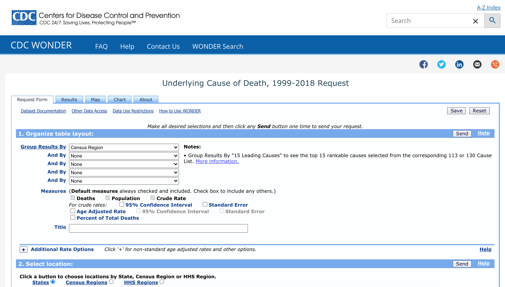
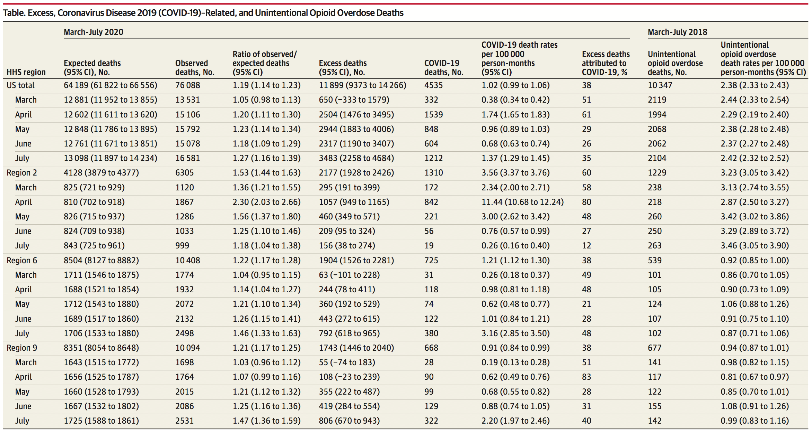

```{r setup, include=FALSE}
knitr::opts_chunk$set(echo = FALSE)
library(tidyverse)
options(scipen=999)
```

I've received a ton of emails from Medium encouraging me to learn ARIMA to apply to stock pricing. I've opened a few of them, but never got into it. But lo and behold, as I was reading a paper from colleage Jeremy Faust, and there it was in the methods...  autoregressive integrated moving averages... ARIMA... the words behind the flashy acronym.


https://twitter.com/EricTopol/status/1339617664612802561?s=20


#Faust Article:
https://jamanetwork.com/journals/jama/fullarticle/2774445


Supplement: https://cdn.jamanetwork.com/ama/content_public/journal/jama/0/jld200124supp1_prod_1608042617.68599.pdf

## Methods

"To determine excess mortality (the gap between observed and expected deaths), projected monthly expected deaths for 2020 were calculated by applying autoregressive integrated moving averages to US population and mortality counts (2015-2019).^[Underlying cause of death, 1999-2018. Centers for Disease Control and Prevention. Accessed October 28, 2020. https://wonder.cdc.gov/ucd-icd10.html]"

"Observed all-cause mortality and COVID-19 mortality (coded as either “underlying cause” or “multiple cause” of death) for March 1, 2020, to July 31, 2020, were obtained from provisional National Center for Health Statistics data (released October 28, 2020).4 Unintentional opioid overdose death counts (International Classification of Diseases, Version 10 codes X41-X44, Y11-Y15, and T40.0-6) for the corresponding period of 2018 (the most recently available data) were assembled for each HHS region.3 Incident rates per 100 000 person-months with 95% CIs were calculated for COVID-19 and unintentional opioid deaths using SAS, version 9.4. Statistical significance was defined as a 95% CI that excluded the null value."


### Download 15-18 Data: CDC WONDER

<!-- - https://www.cdc.gov/nchs/nvss/mortality_methods.htm -->
<!-- - https://www.cdc.gov/nchs/data_access/vitalstatsonline.htm -->
<!-- - http://dataferrett.census.gov/ -->

- HHS Region
- Ten-Year Age Groups
- Year
- Month


```{r}

```

We examined 2020 population and seasonal autoregressive integrated moving averages **for each of the 10 US Department of Health and Human Services (HHS) regions**, which comprise the entire US and are the smallest subdivisions for which 2020 age-stratified COVID-19 mortality data are currently available from the National Center for Health Statistics. Population covariates were used to calculate 95% CIs for expected deaths.

```{r}
cdc1518 <- read.delim("Multiple Cause of Death, 1999-2018.txt", 
                      header = TRUE, sep = "\t", dec = ".") %>% 
  filter(!is.na(Year)) %>% 
  select(Year, 
         Month=Month.Code,
         hhsregion=HHS.Region.Code,
         AgeGroup=Ten.Year.Age.Groups,
         Deaths) %>% 
  separate(Month, into=c(NA,"Month"), sep="/") %>% 
  mutate(Month=as.numeric(Month)) %>% 
  separate(hhsregion, into=c(NA,"hhsregion"), sep="HHS")

cdc1518_kids <- cdc1518 %>% 
  mutate(AgeGroup=as.character(AgeGroup)) %>% 
  filter(AgeGroup=="< 1 year" | AgeGroup=="1-4 years") %>% 
  group_by(Year,Month,hhsregion) %>% 
  mutate(AgeGroup="0-4 years",
         Deaths=sum(Deaths)) %>% ungroup() %>% unique()

cdc1518 <- cdc1518 %>% 
  mutate(AgeGroup=as.character(AgeGroup)) %>% 
  filter(AgeGroup!="< 1 year" & AgeGroup!="1-4 years") %>% 
  rbind(cdc1518_kids) %>% 
  filter(AgeGroup!="Not Stated") %>%
  mutate(AgeGroup=as.factor(AgeGroup))

```

### Download 19-20 Data: Data.CDC.Gov

https://data.cdc.gov/NCHS/Monthly-provisional-counts-of-deaths-by-age-group-/ezfr-g6hf

```{r}
cdc1920 <- read.csv("Monthly_provisional_counts_of_deaths_by_age_group_and_HHS_region_for_select_causes_of_death.csv") %>% 
  select(Year=Date.Of.Death.Year,
         Month=Date.Of.Death.Month,
         hhsregion=HHSRegion,
         AgeGroup,
         Deaths=AllCause) %>% 
  filter(hhsregion != "United States") %>% 
  mutate(AgeGroup=as.character(AgeGroup)) %>% 
  mutate(AgeGroup=case_when(AgeGroup=="85 years and over"~"85+ years",TRUE~AgeGroup)) %>% 
  mutate(AgeGroup=as.factor(AgeGroup))
```

```{r warning=F,message=F}
# cdc1920 %>% 
#   filter(Date.Of.Death.Month>=3 & Date.Of.Death.Month<=7) %>% 
#   filter(AgeGroup=="25-34 years" | AgeGroup=="35-44 years") %>% 
#   filter(Date.Of.Death.Year==2020) %>% 
#   filter(HHSRegion=="United States"|HHSRegion=="2"|HHSRegion=="6"|HHSRegion=="9") %>% 
#   group_by(HHSRegion, Date.Of.Death.Month) %>% 
#   summarise(AllCause=sum(AllCause,na.rm = T))
```


### Combine 15-20 Data

```{r warning=F, message=F}
cdc<-rbind(cdc1518,cdc1920)

cdc_US <- cdc %>% 
  group_by(Year, Month, AgeGroup) %>% 
  summarise(Deaths=sum(Deaths,na.rm = T)) %>% 
  mutate(hhsregion=as.factor("United States")) %>% 
  ungroup()

cdc <- cdc %>% rbind(cdc_US)

```

```{r}
library(lubridate)
cdc_US %>% 
  mutate(Month=as.character(Month)) %>% 
  mutate(Month=case_when(nchar(Month)==1~paste0("0",Month),TRUE~Month)) %>% 
  mutate(DT=paste0(Year,"-",Month,"-01"),
         DT=ymd(DT)) %>% 
  ggplot(aes(x=DT,y=Deaths,col=AgeGroup))+geom_line()
```

### Table


```{r}

```

```{r}
cdc %>%
  filter(Year==2020 & Month >= 3 & Month <= 7) %>%
  filter(hhsregion=="United States" | hhsregion=="2" | hhsregion=="6" | hhsregion=="9") %>% 
  group_by(hhsregion,Month) %>%
  summarise(Deaths = sum(Deaths))
```


```{r}
# cdc %>% 
#   ggplot(aes(x=Month,y=Deaths,fill=AgeGroup))+
#   geom_col()+facet_wrap(vars(Year))
```


### ARIMA

ARIMA = Auto Regressive Integrated Moving Average

https://otexts.com/fpp2/arima.html

https://otexts.com/fpp2/arima-r.html

####

- **Stationary Series**
  + Mean is constant, not a function of time
  + Variance is not a function of time (homoscedasticity)
  + Covariance is not a function of time
  
Unless your time series is stationary, you cannot build a time series model. In cases where the stationary criterion are violated, the first requisite becomes to stationarize the time series and then try stochastic models to predict this time series.

"A stationary series has no trend, its variations around its mean have a constant amplitude, and it wiggles in a consistent fashion, i.e., its short-term random time patterns always look the same in a statistical sense.  The latter condition means that its autocorrelations (correlations with its own prior deviations from the mean) remain constant over time, or equivalently, that its power spectrum remains constant over time." (https://people.duke.edu/~rnau/411arim.htm)

"Random-walk and random-trend models, autoregressive models, and exponential smoothing models are all special cases of ARIMA models."

A nonseasonal ARIMA model is classified as an "ARIMA(p,d,q)" model, where:
- p is the number of autoregressive terms,
- d is the number of nonseasonal differences needed for stationarity, and
- q is the number of lagged forecast errors in the prediction equation.


- ARIMA(1,0,0) = first-order autoregressive model: if the series is stationary and autocorrelated, perhaps it can be predicted as a multiple of its own previous value, plus a constant.


  
- **Random Walk**

ACF and lag?

```{r}
# https://otexts.com/fpp2/stationarity.html
# install.packages('fpp2', dependencies = TRUE)
library(fpp2)
goog200 <- goog200
```

<!-- The price of Google increased from $400 to ~$$550 over 200 days. -->

```{r}
# https://rpubs.com/pg2000in/ForecasterToolBox
beer2 <- window(ausbeer,start=1992,end=c(2007,4))
plot(beer2)
```

https://otexts.com/fpp2/autocorrelation.html

The **autocorrelation** coefficients are plotted to show the autocorrelation function or ACF. The plot is also known as a correlogram.

```{r}
#ggAcf(goog200)
ggAcf(beer2)
```


```{r}
ggAcf(diff(goog200))
```


Chapter 6 Time series decomposition
https://otexts.com/fpp2/decomposition.html


```{r}
cdc_US_all <- cdc_US %>% group_by(Year,Month) %>% summarise(Deaths = sum(Deaths))

myts <- ts(cdc_US_all$Deaths, start=c(2015, 1), end=c(2020, 02), frequency=12)

# subset the time series (June 2014 to December 2014)
myts2 <- window(myts, start=c(2014, 6), end=c(2014, 12))

# plot series
plot(myts)
```

```{r}
ggAcf(myts)
```

```{r}
ggAcf(diff(myts))
```


```{r}
Box.test(diff(myts), lag=12, type="Ljung-Box")
```

```{r}
arima_fit <- auto.arima(myts)
```


```{r}
autoplot(forecast(arima_fit))

forecast(arima_fit)
```

```{r}
cdc_US_25_44 <- cdc_US %>% filter(AgeGroup=="25-34 years"|AgeGroup=="35-44 years") %>% 
  group_by(Year,Month) %>% summarise(Deaths = sum(Deaths))

myts2 <- ts(cdc_US_25_44$Deaths, start=c(2015, 1), end=c(2020, 02), frequency=12)

arima_fit2 <- auto.arima(myts2)

forecast(arima_fit2,h=5) #%>% head(7)
```

```{r}
arima_forecast <- forecast(arima_fit2,h=5)


FaustTable <- cdc_US_25_44 %>% filter(Year==2020 & Month <= 7 & Month>=3)

cdc1920_temp <- cdc1920 %>% filter(Date.Of.Death.Year==2020 & Date.Of.Death.Month<=7  & Date.Of.Death.Month>=3) %>% 
  filter(AgeGroup=="25-34 years"|AgeGroup=="35-44 years") %>% 
  filter(HHSRegion=="United States") %>% 
  select(Year=1,Month=2,AgeGroup,COVID_Mult=18,COVID_Underly=19) %>% 
  group_by(Year,Month) %>% 
  summarise(COVID_Mult = sum(COVID_Mult,na.rm=T),
            COVID_Underly = sum(COVID_Underly,na.rm=T))
  
options(digits=0)
#FaustTable$Expected <- paste0(arima_forecast$mean," (",arima_forecast$lower[,2]," to ",arima_forecast$upper[,2])

FaustTable$Expected <- arima_forecast$mean


FaustTable$Expected_L <- arima_forecast$lower[,2]

FaustTable$Expected_H <-arima_forecast$upper[,2]

FaustTable$Ratio <- FaustTable$Deaths/FaustTable$Expected
  
FaustTable$Ratio_L <- FaustTable$Deaths/FaustTable$Expected_H

FaustTable$Ratio_H <- FaustTable$Deaths/FaustTable$Expected_L

FaustTable$ExcessDeaths <- FaustTable$Deaths - FaustTable$Expected

FaustTable$ExcessDeaths_L <- FaustTable$Deaths - FaustTable$Expected_H

FaustTable$ExcessDeaths_H <- FaustTable$Deaths - FaustTable$Expected_L

FaustTable$COVID_Deaths <- cdc1920_temp$COVID_Mult

options(digits=2)
FaustTable$ExcessAttCOVID <- FaustTable$COVID_Deaths/FaustTable$ExcessDeaths
```


- Rho Coefficient

- Dickey Fuller Test of Stationarity


### Back to the Methods


